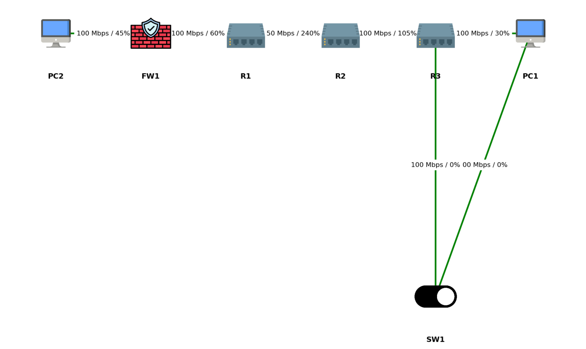

# 🛰️ Network Topology Analyzer – VIP 2025 (Cisco Industry Project)

## 📌 Overview

This project automates **network topology discovery, validation, and traffic simulation** from router configuration files.

It parses configs → builds a graph → validates IP/MTU/protocols → simulates traffic demands → detects overloaded links → suggests load balancing or upgrades.

Extra features:

* Topology visualization with device icons (Router, Switch, Firewall, PC).
* Link failure simulation with connectivity impact.
* Optional Web UI (Streamlit).
* Optional Excel report with conditional formatting.

---

## ⚙️ Tech Stack

* **Python 3.12+**
* [NetworkX](https://networkx.org/) – topology graph
* [Matplotlib](https://matplotlib.org/) – visualization
* [Streamlit](https://streamlit.io/) – optional web UI
* [openpyxl](https://openpyxl.readthedocs.io/) – Excel export

---

## 📂 Project Structure

```
CISCO/
│── main.py              # Core script (parse configs, build graph, simulate)
│── faults.py            # Link failure simulation logic
│── streamlit_app.py     # Optional Streamlit UI
│── requirements.txt     # Python dependencies
│── Conf/                # Sample device config files
│   ├── R1/config.dump
│   ├── R2/config.dump
│   ├── R3/config.dump
│   ├── FW1/config.dump
│   ├── SW1/config.dump
│   ├── PC1/config.dump
│   └── PC2/config.dump
│── icons/               # Device icons
│   ├── router.png
│   ├── switch.png
│   ├── firewall.png
│   ├── pc.png
│   └── device.png
│── reports/             # Auto-generated Excel reports (optional)
│── README.md            # Documentation
```

---

## 🚀 Installation

```bash
# 1. Clone project
git clone https://github.com/iamdeepak2005/Cisco-
cd CISCO

# 2. Create virtual environment
python -m venv venv
venv\Scripts\activate   # On Windows
# source venv/bin/activate  # On Linux/Mac

# 3. Install dependencies
pip install -r requirements.txt
```

---

## ▶️ Running the Project

### 1. Console Mode (Main Script)

```bash
python main.py
```

✅ This will:

* Parse configs
* Build & visualize topology
* Run validation checks
* Simulate traffic & link failures
* Print utilization report

### 2. Web UI (Optional)

```bash
streamlit run streamlit_app.py
```

✅ Features:

* Upload configs
* Visualize topology interactively
* Simulate link failures with a button
* Download Excel report

---

## 📊 Example Output

### Console

```
Validation Report:
No major issues found.

=== Link Utilization ===
R1 — R2   cap=100000 kbps  load=120000 kbps  util=120.00%  OVERLOADED
R2 — R3   cap= 50000 kbps  load=130000 kbps  util=260.00%  OVERLOADED

=== Load Balancing Recommendations ===
R1->R3 (60 Mbps): no clean alternate found. Consider capacity upgrade or policy-based split.
```

### Graph (Matplotlib)



### Excel Report (Bonus)

* Green → under-utilized
* Orange → high utilization
* Red → overloaded

---

## 📌 Deliverables Checklist

✔️ Config parsing (hostname, IPs, bandwidth, MTU, protocols)
✔️ Auto topology discovery
✔️ Visualization with icons
✔️ Validation (duplicate IPs, loops, MTU mismatch, protocol recommendation)
✔️ Traffic simulation & capacity check
✔️ Load balancing recommendations
✔️ Link failure simulation
✔️ Final report (console + optional Excel + optional UI)

